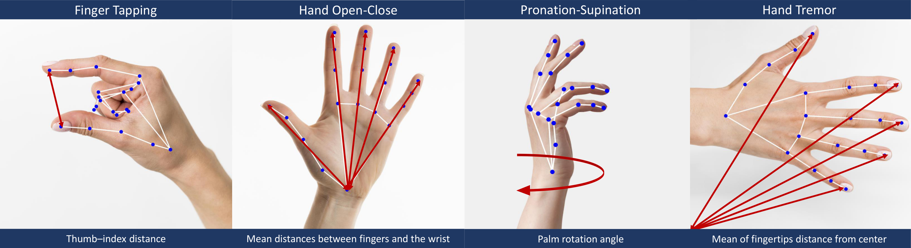

# Hand Movement Training & Inference

Shareable package for **training**, **evaluating**, and **running inference** on four MDS-UPDRS hand motor tasks.

| Task | MDS item | Data column |
|------|----------|-------------|
| Finger Tapping | 3.4 | `Finger Normalized Distance` |
| Hand Open/Close | 3.5 | `Normalized Hand Sum Finger Distances` |
| Hand Pronation-Supination | 3.6 | `yaw_rad` |
| Hand Tremor | 3.11 | `mean_fingertip_distance_from_center` |

Each task predicts **severity** (0–3). Symptom column names are listed in `configs/*.json`.



*MDS-UPDRS hand motor tasks and the kinematic features extracted from pose: finger tapping (thumb–index distance), hand open/close (mean finger–wrist distances), pronation–supination (palm rotation angle), and hand tremor (mean fingertip distance from center). Source: [figure_2.pdf](docs/figures/figure_2.pdf).*

---

## Project structure

```
PortalAnalysis/
├── portal_analysis/
│   ├── cli.py                     # train | evaluate | predict
│   ├── config.py                  # Default N:/ paths
│   ├── data/data_loader.py        # Labels + time series loading
│   ├── training/                  # Pipeline, artifacts, metrics
│   ├── classification/            # MiniRocket + augmentation
│   ├── preprocessing/             # Video → pose → distances
│   ├── models/                    # Load/save + path resolution
│   └── inference/                 # Per-task + batch inference
├── configs/                       # Task JSON (committed to git)
│   ├── finger_tapping.json
│   ├── hand_open_close.json
│   └── hand_up_down.json
├── models/                        # Trained artifacts (in git)
├── scripts/
│   ├── train_models.py
│   └── run_inference.py
```

---

## Output structure

End-to-end processing writes inference artifacts under `results/` at the processed data root (`N:/Booth_Processed` by default, or `PORTAL_DATA_DIR`). Training data may still use the per-task booth layout under each task folder.

### Processed data layout

**Inference** (video, pose, or csv modes via `scripts/run_inference.py`) records outputs here:

```
Booth_Processed/
└── results/
    ├── inference/                 # per-recording severity (+ optional symptoms)
    │   └── SUBJECT_DATE_right_finger_tapping_inference.json
    ├── pose/                      # MediaPipe landmark CSVs (video / pose modes)
    │   └── SUBJECT_DATE_right_finger_tapping.csv
    ├── distances/                 # kinematic time series
    │   └── SUBJECT_DATE_right_finger_tapping_distances.csv
    └── plots/                     # feature-over-time PNGs
        └── SUBJECT_DATE_right_finger_tapping_distances.png
```

All per-recording artifacts share the stem ``{patient_id}_{side}_{task}`` (e.g. ``SUBJECT_DATE_right_finger_tapping``), with task-specific suffixes ``.csv``, ``_distances.csv``, ``_distances.png``, or ``_inference.json``.

**Training / legacy booth layout** (optional; csv mode can still read distances from here):

```
Booth_Processed/
├── finger_tapping/
│   ├── right/
│   │   ├── videos/
│   │   ├── pose/
│   │   └── distances/
│   ├── left/ …
│   └── docs/                # weak_supervision_final.csv, test-set-balanced.csv
├── hand_open_close/ …
└── hand_up_down/ …
```


### Pose CSV (`pose/<patient_id>_<side>_<task>.csv`)

One row per detected hand per frame (MediaPipe, 21 landmarks):

| Column | Description |
|--------|-------------|
| `frame_number` | Frame index in the source video |
| `hand_id`, `hand_label` | Hand index and corrected left/right label |
| `hand_width`, `hand_height` | bounding-box size |
| `x_0`…`x_20`, `y_0`…`y_20`, `z_0`…`z_20` | Landmark coordinates (0–1) |

### Distances CSV (`distances/<patient_id>_<side>_<task>_distances.csv`)

Time-series features derived from pose. **Finger tapping** files are written by `DistanceCalculator` with:

| Column | Description |
|--------|-------------|
| `Frame` | Frame number |
| `Finger Distance` | Thumb–index 3-D distance (pixels) |
| `Finger Normalized Distance` | Distance normalized by hand scale (**used for finger tapping inference**) |
| `Angular Distance` | Wrist angle (degrees) |
| `Wrist Coordinate` | Scaled wrist position |
| `Hand BBox Width`, `Hand BBox Height` | Hand bounding box (pixels) |

**Hand open/close** and **pronation–supination** use task-specific columns already present in `Booth_Processed`:

| Task | Inference column |
|------|------------------|
| Hand open/close | `Normalized Hand Sum Finger Distances` |
| Pronation–supination | `yaw_rad` |

Matching pose files omit the `_distances` suffix (e.g. `SUBJECT_DATE_right_finger_tapping.csv`).

### UPDRS severity scores (inference)

Each recording yields an **MDS-UPDRS Part III severity** class **0–3** (0 = normal, 1 = slight, 2 = mild, 3 = moderate/severe).

With `--with-symptoms`, each JSON file also includes a `symptoms` object with four **clinical motor signs** (binary 0 = absent, 1 = present):

| Sign | JSON field (`symptoms.*`) |
|------|---------------------------|
| Amplitude reduction | `amplitude_reduction` |
| Sequence effect | `sequence_effect` |
| Slowness | `slowness` |
| Halt / hesitation | `halt_hesitation` |

Symptom models are trained separately (`train-symptoms`) and stored under `models/<task>/<version>/symptoms/<sign>/`. Source label columns per task match the Hand-Movement-Analysis symptom notebooks (see `portal_analysis/inference/symptoms.py`).

**Per-recording inference JSON** (`Booth_Processed/results/inference/<recording_id>_inference.json`):

```json
{
  "patient_id": "SUBJECT_DATE_001_right_finger_tapping",
  "task": "finger_tapping",
  "subtask": "right",
  "severity": 2,
  "raw_sequence_length": 412,
  "symptoms": {
    "amplitude_reduction": 0,
    "sequence_effect": 1,
    "slowness": 0,
    "halt_hesitation": 0
  }
}
```

The `symptoms` block is omitted when inference runs without `--with-symptoms`. `severity` is `null` if the distances file was missing or invalid.

Six JSON files per patient when all three tasks and both hands run successfully.

### Training artifacts & evaluation metrics

Training does **not** write pose or distances; it reads existing `distances/` CSVs and saves models under `models/`:

```
models/<task>/<version>/
├── classifier.joblib
├── rocket.joblib
├── metadata.json      # task config, train/test counts, accuracy/MAE/MSE on held-out test set
└── symptoms/          # optional, after train-symptoms
    ├── amplitude_reduction/
    ├── sequence_effect/
    ├── slowness/
    └── halt_hesitation/
```

`metadata.json` includes a `dataset` object (`n_train`, `n_test`, `n_evaluated`) recording how many sequences were used for training and evaluation.

`evaluate` prints a classification report and confusion matrix to the terminal; metrics are also stored in `metadata.json`.

---

## Installation

```bash
conda env create -f environment.yml
conda activate booth_inference
pip install -e .
```

**Data path** (pick one):

- Default: `portal_analysis/config.py` → `N:/Booth_Processed`
- Override: `set PORTAL_DATA_DIR=N:\Booth_Processed`
- Or add a root `config.py` with `BASE_PROCESSED_DIRECTORY`

---

## Training

```bash
python -m portal_analysis.cli train --tasks all
python -m portal_analysis.cli train --tasks all --version v1.0.0
python -m portal_analysis.cli train-symptoms --tasks all
python -m portal_analysis.cli evaluate --model models/hand_open_close/v1.0.0
```

Artifacts are committed under `models/<task>/<version>/` (see layout above). Symptom classifiers live in `models/<task>/<version>/symptoms/<sign>/`. To release: train severity and symptoms with `--version`, commit, tag, push.

---

## Inference

Three entry points: **pose** (landmark CSVs), **csv** (feature time series), or **video** (full pipeline).

| Mode | Input | Best for |
|------|--------|----------|
| `pose` | `--pose-path` and/or `…/pose/<id>_<side>_<task>.csv` under `--processed-dir` | You already ran MediaPipe (or have Booth pose exports) |
| `csv` | `--distances-path` and/or `…/distances/<id>_<side>_<task>_distances.csv` under `--processed-dir` | Feature CSVs ready for all tasks |
| `video` | `--video-path` and/or MP4s under `--raw-dir` | End-to-end from recordings |

Pose mode writes distances under `distances/` and then predicts severity. **Finger tapping** is fully supported from pose; hand open/close and pronation need distances CSVs with their own columns (use `csv` mode).

Use `--hand left`, `--hand right`, or `--hand both` (default) to run one or both sides per task.

### From pre-computed pose CSVs

Explicit pose file(s) (same pattern as `--video-path`):

```bash
python scripts/run_inference.py \
    --mode pose \
    --patient-id SUBJECT_DATE_001 \
    --processed-dir N:/Booth_Processed \
    --pose-path "N:/path/to/right_finger_tapping.csv" \
    --hand right
```

Task and side are inferred from the filename (e.g. `right_finger_tapping.csv`). Use one `--patient-id` per run. Distances are written under `--processed-dir` in the booth layout.

For non-standard filenames:

```bash
python scripts/run_inference.py \
    --mode pose \
    --patient-id subject_003 \
    --processed-dir N:/Booth_Processed \
    --pose-path "N:/path/to/custom_pose_export.csv" \
    --task finger_tapping \
    --hand left \
    --video-width 1920 \
    --video-height 1080
```

`--video-width` / `--video-height` must match the resolution used when the pose was extracted (MediaPipe coords are normalized 0–1 and scaled back to pixels).

Booth directory layout (all pose files for listed patients):

```bash
python scripts/run_inference.py \
    --mode pose \
    --patient-id SUBJECT_DATE_001 \
    --processed-dir N:/Booth_Processed \
    --tasks finger_tapping \
    --hand both
```

Expected paths (right hand, finger tapping example):

```
Booth_Processed/results/pose/SUBJECT_DATE_001_right_finger_tapping.csv
→ Booth_Processed/results/distances/SUBJECT_DATE_001_right_finger_tapping_distances.csv  (written automatically)
→ Booth_Processed/results/plots/SUBJECT_DATE_001_right_finger_tapping_distances.png
```

Legacy pose files under `finger_tapping/<side>/pose/` are still read when present.

### From pre-computed distances CSVs

Explicit distances file(s):

```bash
python scripts/run_inference.py \
    --mode csv \
    --patient-id SUBJECT_DATE_001 \
    --processed-dir N:/Booth_Processed \
    --distances-path "N:/path/to/right_finger_tapping_distances.csv" \
    --hand right
```

Task and side are inferred from the filename (e.g. `right_finger_tapping_distances.csv` or `SUBJECT_001_right_open_close_distances.csv`). Use one `--patient-id` per run.

For non-standard filenames:

```bash
python scripts/run_inference.py \
    --mode csv \
    --patient-id subject_003 \
    --processed-dir N:/Booth_Processed \
    --distances-path "N:/path/to/features.csv" \
    --task hand_open_close \
    --hand left
```

Booth directory layout (all distances for listed patients):

```bash
python scripts/run_inference.py \
    --mode csv \
    --patient-id SUBJECT_DATE_001 \
    --processed-dir N:/Booth_Processed \
    --model-version latest \
    --with-symptoms
```

Use directory mode for **all three tasks** when distances already exist under the standard layout (required for hand open/close and pronation).

### From raw videos (full pipeline)

Explicit video file(s):

```bash
python scripts/run_inference.py \
    --mode video \
    --patient-id SUBJECT_DATE_001 \
    --processed-dir N:/Booth_Processed \
    --video-path "N:/path/to/right_finger_tapping.mp4" \
    --hand right
```

Task and side are inferred from the filename (e.g. `right_finger_tapping.mp4`). Use one `--patient-id` value per run. With `--hand left` or `--hand right`, only matching videos are processed.

For non-standard filenames, set the task and hand explicitly:

```bash
python scripts/run_inference.py \
    --mode video \
    --patient-id subject_003 \
    --processed-dir N:/Booth_Processed \
    --video-path "N:/path/to/FUSBG_PILOT_02_Fingertapping-L-Pre.mp4" \
    --task finger_tapping \
    --hand left
```

Booth directory layout (all videos for listed patients):

```bash
python scripts/run_inference.py \
    --mode video \
    --patient-id SUBJECT_DATE_001 \
    --raw-dir "N:/CAMERA Booth Data/Booth" \
    --processed-dir N:/Booth_Processed
```


---

## Tests

```bash
pip install pytest
pytest tests/test_pipeline_smoke.py -v
```

